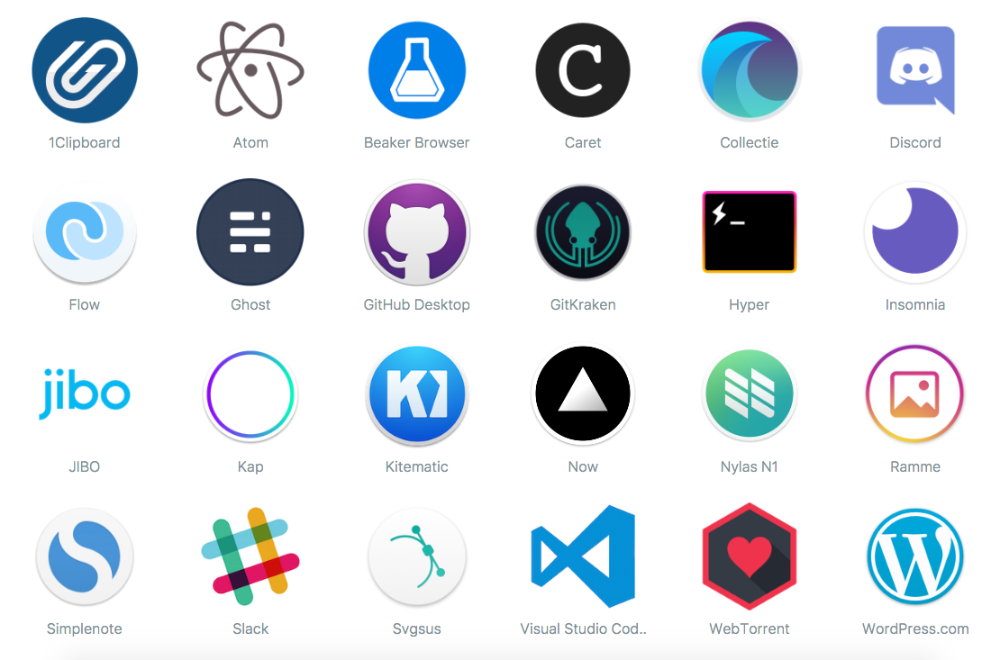

# Electron

[https://electron.atom.io/](https://electron.atom.io/)

Build cross platform desktop apps with JavaScript, HTML, and CSS

## It's easier than you think
If you can build a website, you can build a desktop app. It takes care of the hard parts so you can focus on the core of your application.

## Cross Platform
Mac, Windows, and Linux

## Feature
* Automatic updates
* Native menus & notifications
* Crash reporting
* Debugging & profiling
* Windows installers

## Apps built on Electron

# NW.js (node-webkit)

[https://nwjs.io/](https://nwjs.io/)

lets you call all Node.js modules directly from DOM and enables a new way of writing applications with all Web technologies.

# Electron vs NW.js
[http://tangiblejs.com/posts/nw-js-and-electron-compared-2016-edition](http://tangiblejs.com/posts/nw-js-and-electron-compared-2016-edition)

## Github statistics

| repository    | Watch   | Star    | Fork    |
| ------------- |:-------:| -------:| -------:|
| electron      | 2133    | 46043   | 5689    |
| nw.js         | 1800    | 31542   | 3524    |

*TODO Show real time data*

## Other links

* [维护一个大型开源项目是怎样的体验？](https://www.zhihu.com/question/36292298)
* [[开源专访]Node-Webkit作者王文睿：桌面应用的全新开发方式](http://www.csdn.net/article/2014-01-08/2818066-Node-Webkit)
* [速来膜拜！20位活跃在Github上的国内技术大牛](http://code.csdn.net/news/2821086)
